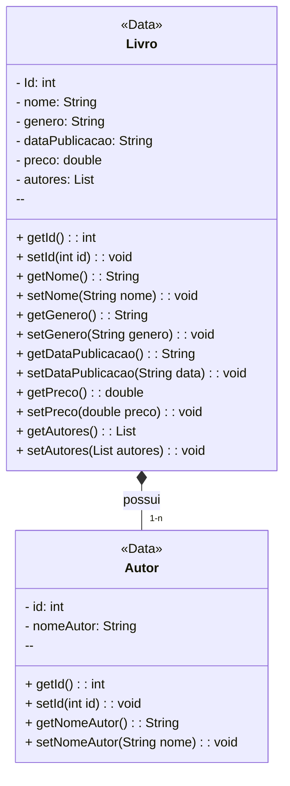

#API-LIBRARY

Uma APIrestFul criada para fins educacionais.

##Diagrama de Classes

```mermaid
classDiagram
    class Livro {
        <<Data>>
        - Id: int
        - nome: String
        - genero: String
        - dataPublicacao: String
        - preco: double
        - autores: List<Autor>
        --
        + getId(): int
        + setId(int id): void
        + getNome(): String
        + setNome(String nome): void
        + getGenero(): String
        + setGenero(String genero): void
        + getDataPublicacao(): String
        + setDataPublicacao(String data): void
        + getPreco(): double
        + setPreco(double preco): void
        + getAutores(): List<Autor>
        + setAutores(List<Autor> autores): void
    }
    
    class Autor {
        <<Data>>
        - id: int
        - nomeAutor: String
        --
        + getId(): int
        + setId(int id): void
        + getNomeAutor(): String
        + setNomeAutor(String nome): void
    }
    
    Livro *-- "1-n" Autor : possui
```
